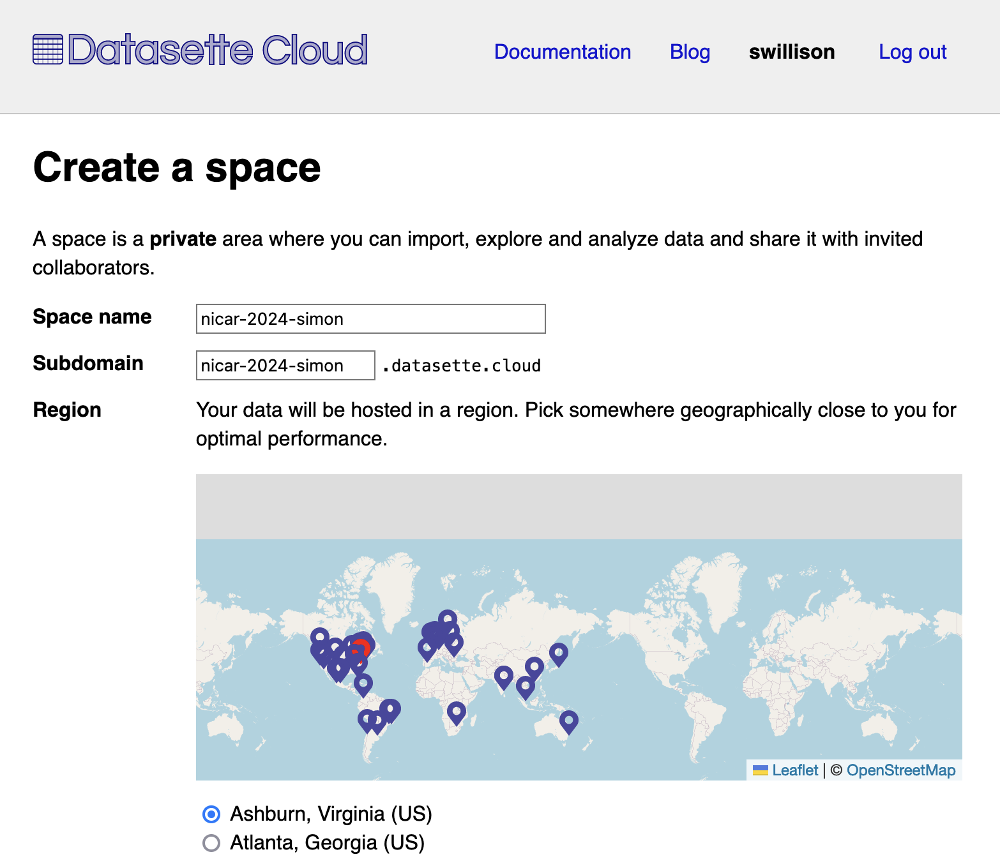
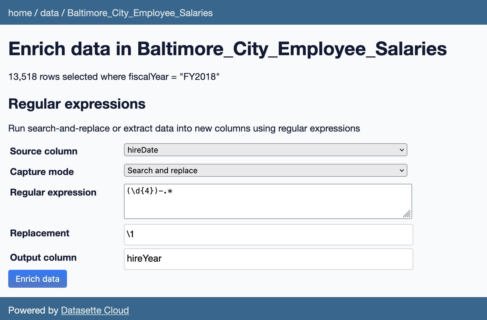

# NICAR24 Datasette Workshop

[Friday March 8th, 11:30am](https://schedules.ire.org/nicar-2024/index.html#1110) in [Baltimore, Maryland](https://schedules.ire.org/nicar-2024)

Your instructors:

- Simon Willison
- Alex Garcia

## Questions and shared notes

- We will be monitoring [this Google Doc](https://docs.google.com/document/d/1OyEjk7yoQMdyhkAccRvg7R17nEHpIXpSs8BBIH78wWU/edit) during the workshop for questions. Please feel free to use it to share notes as well - things that we missed can then be incorporated into the tip sheet after the session.

## Getting Help

- [Datasette on Discord](https://datasette.io/discord)
- The `#proj-datasette` channel in the [News Nerdery Slack](https://newsnerdery.org/)
- The [Github Discussions page on Datasette](https://github.com/simonw/datasette/discussions)

## How to run Datasette on a laptop

This will be a walkthrough of the Datasette open source project! This can be ran either on the conference-provided laptops, as long as you have a working Python environment (ie can `pip install`) packages.

### 1. Installing Datasette and `sqlite-utils`

On the command line, run:

```bash
pip install datasette sqlite-utils
```

To make sure it installed correctly:

```bash
datasette --version

sqlite-utils --version
```

For this workshop, we will use the [`datasette-upload-csvs`](https://github.com/simonw/datasette-upload-csvs) plugin, which can be installed with:

```bash
datasette install datasette-upload-csvs
```

### 2. Uploading a CSV

We will be working with the [San Fransisco Supplier Contracts](https://data.sfgov.org/City-Management-and-Ethics/Supplier-Contracts/cqi5-hm2d/about_data)
dataset. [Download the CSV here](https://gist.githubusercontent.com/asg017/144d059dbad77135a50ef3cd8590aad5/raw/sf_supplier_contracts.csv).

Now startup Datasette with an empty database like so:

```bash
datasette --create nicar24.db --root
```

<details>
<summary>Explanation of flags</summary>
<li>The <code>--create</code> flag will create the <code>nicar24.db</code> database for you. Without it, an <code>nicar24.db file not found</code> error would be raised</li>
<li>The <code>--root</code> flag will print out a signed URL, which grants a view higher privileges, like uploading CSVs.
</details>

Copy+paste the `http://127.0.0.1:8001/-/auth-token?token=...` URL into a web browser. You should see "root" in the top-right corner.

Navigate to the top-right corner menu and select "Upload CSVs". Drag+ drop the `sf_supplier_contracts.csv` file, and name the table `sf_supplier_contracts`.

After importing is complete, you'll have a new `sf_supplier_contracts` table to explore!

### 3. Building a search engine on NICAR24 Sessions

Now we'll focus on a 2nd way to import data, using the `sqlite-utils` CLI. Download the [`nicar-2024-schedule.csv`](https://schedules.ire.org/nicar-2024/nicar-2024-schedule.csv) file to your project folder.

To import the CSV to your SQLite database, we'll use `sqlite-utils` like so:

```bash
sqlite-utils insert nicar24.db sessions nicar-2024-schedule.csv  --csv
```

Start Datasette back up with:

```bash
datasette nicar24.db
```

<details>
<summary>No need for the <code>--create</code> or <code>--root</code> flags!</summary>
Since the <code>nicar24.db</code> database has been created, and we aren't uploading CSVs through the Datasette interface anymore, there's no need for those flags anymore.
</details>

Open `http://127.0.0.1:8001` and checkout the new `sessions` table.

If we want to add a search field to the session_description column, we could run:

```bash
sqlite-utils enable-fts nicar24.db sessions session_description
```

## Introduction to Datasette Cloud

Datasette Cloud is a collaborative space for your newsroom to share and analyze data

It's all built on open source Datasette components: if you want to build your own you are welcome to do so! It will probably cost you more time than having us run it for you though.

Each organization gets a "space" - a private space to collaborate on data.

### 1. Creating a space

Let's create a space now:

- Go to https://www.datasette.cloud/ and create an account - I recommend sign in with Google, that way you don't have to deal with Yet Another Password.
- Enter the invite code we distributed in the session...
- ... and create a space. Datasette Cloud is built on top of [Fly.io](https://fly.io/) which means we can run your space in many different locations around the world. The default in Virginia works just fine though.
- Spaces can take up to a minute to be created the first time.
  - Each space runs on a separate container, for security and to ensure the performance of one space doesn't impact any others
  - We'll start you with 2GB of volume space but this can be increased up to 500GB
  - Your data is continually backed up to a private S3 bucket using Litestream. You can download snapshots of the data directly.
  - Philosophically, avoiding lockin is very important to us. You should be able to extract your data at any time, in an open format



### 2. Importing some data

Once the space is up and running! Let's import some data. There are several ways to load data into Datasette Cloud:
- Uploading CSV files
- Importing CSV files from a URL
- Using the Datasette Cloud API
- ... and a new option using AI, which we'll try out shortly

Let's start with an import from a URL - we'll use the Global Power Plants example on the site.

- Click "The Global Power Point Database" to get started
- Once it has imported, rename that table:
  - Table actions -> Edit table schema -> Enter a new name -> Click "Rename"
- And we get our first visualization! Because it has latitude and longitude columns we can see it on a map.

## 2. Uploading CSV files

Next we'll upload some CSV data.
- Download a copy of the CSV of Baltimore Grocery Stores from https://data.baltimorecity.gov/datasets/baltimore::grocery-stores/explore
- Click "Upload CSV files" on the homepage and drag on the file
- This gets a map too!

Let's try a larger CSV
- Download the CSV of Baltimore City Employee Salaries from https://catalog.data.gov/dataset/baltimore-city-employee-salaries-b820d
- Upload the file
- Edit schema to change the type on `annualSalary` and `grossPay` to float. This means we can sort them.
- Let's start exploring! Find the highest paid employee.
- We can run a custom SQL query to see the department with the highest average:
  ```sql
  select agencyName, avg(grossPay) from Baltimore_City_Employee_Salaries
  group by agencyName
  order by avg(grossPay) desc
  ```

## 3. Running an enrichment

[Enrichments](https://enrichments.datasette.io/) are a powerful new Datasette feature ([introduced here](https://simonwillison.net/2023/Dec/1/datasette-enrichments/)) which allow you to run data modification operations against rows in a table. They are based around plugins, which means new enrichments can be added with [very little code](https://enrichments.datasette.io/en/stable/developing.html).

Now we'll use the regular expression enrichment to add a `hireYear` column:

- Table actions -> Enrich selected data -> Regular expressions
- Source column: `hireDate`
- Capture mode: "Store first match in single column"
- Regular expression: `(\d{4})-.*`
- Output column: `hireYear`



## 4. Building a search engine

We'll repeat the exercise from earlier with the NICAR schedule. This time, upload the `nicar-2024-schedule.csv` file to Datasette Cloud to create a table.

Now we can enable full-text search using the interface:

- Table actions -> Configure full-text-search
- Select `session_title` and `session_description`
- Click the blue button

## 5. Enriching with GPT-4

Let's write a haiku for every NICAR session!

- Table actions -> Enrich selected data -> AI analysis with OpenAI GPT
- Model: `gpt-3.5-turbo` - it's very fast, cheap and writes terrible but entertaining haikus
- Prompt: `{{ session_title }} {{ session_description }}`
- System prompt: `Turn this into a haiku`
- Output column: `haiku`
- Start the enrichment

You can use haiku column -> cog menu -> Show not-blank rows to see the haikus it has written so far.

## 5. Publishing a table

Everything in Datasette Cloud is private, but you can publish individual tables to make them available to anyone with the URL.

Try this on the `nicar-2024-schedule` table:

- Table actions -> Make table public
- Confirm that you want to change the privacy for the table
- The table is now available to anyone at `your-subdomain.datasette.site/data/nicar-2024-schedule`

You can tell if a table is public due to the lack of a padlock icon (we'll be making this more clear soon).

Published tables include the search and filtering interface, and support both `.json` API access and `.csv` exports.

# Demo: `datasette-comments`

(or is this a part of Datasette cloud?)

# Demo: `datasette-scribe`

TODO Alex
